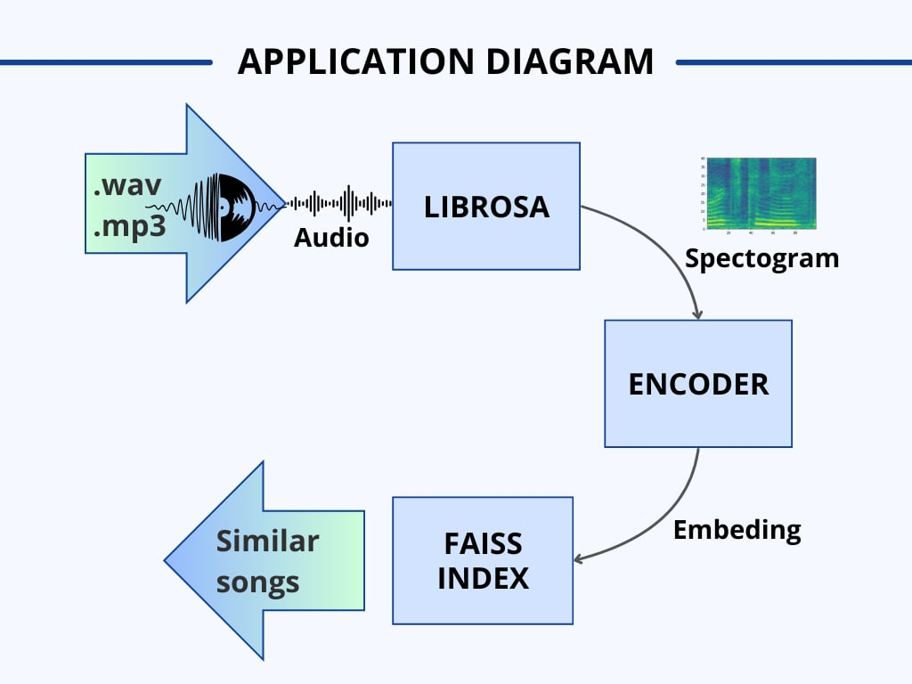
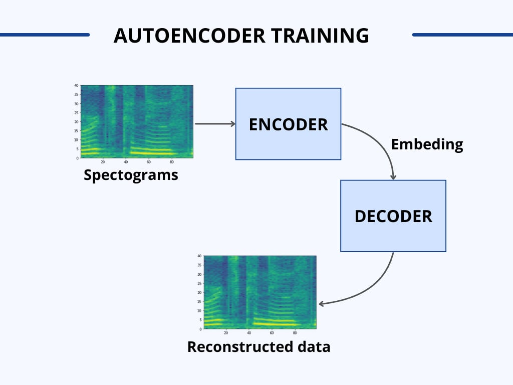
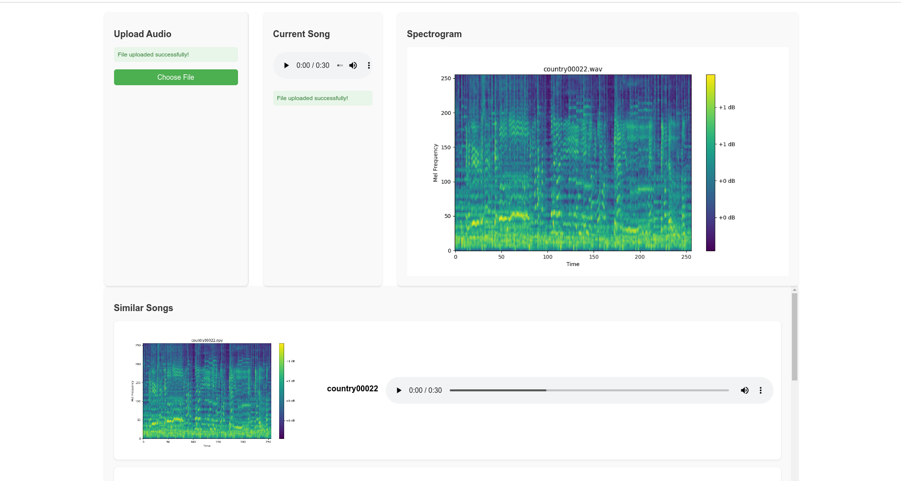

# 🎵 Song Recommender  

Song Recommender is a **full-stack Django application** that recommends similar songs based on their spectrograms. The app compares the spectrogram of an uploaded song to those in a database and suggests similar tracks.  

## 🛠 How It Works  


1. The **user uploads** an audio file (`.wav`, `.mp3`).  
2. Using the **Librosa** library, a **spectrogram** is generated from the audio.  
3. The **encoder** creates an **embedding** from the spectrogram.  
4. The **FAISS index** (a vector database) compares the embedding to existing songs.  
5. Based on similarity, the app **recommends** songs.  

📌 **Model Training**  

- The **encoder** is trained using **TensorFlow**.  
- **Input:** Spectrogram (NumPy array).  
- **Output:** Embedding, which is then passed to the **decoder**.  
- **Decoder Output:** Reconstructed approximation of the original spectrogram.  

## 📌 Installation & Setup  

### 1️⃣ Install dependencies  
```bash
pip install -r requirements.txt
```

### 2️⃣ Download Static Files  
- Download the **static archive** from Google Drive.  
- Unpack the archive and place the `static` folder in the **working directory**.  

### 3️⃣ Run the Server  
```bash
python manage.py runserver
```

### 4️⃣ Upload Songs  
- Open `http://localhost:5000/upload` in your browser.  

## 🖼️ Application Screenshot  


## 🏗️ Technologies Used  
- **Librosa** – Creating spectrograms  
- **TensorFlow** – Training the autoencoder  
- **FAISS** – Vector database for similarity search  
- **Django** – Backend framework for the full-stack application  
